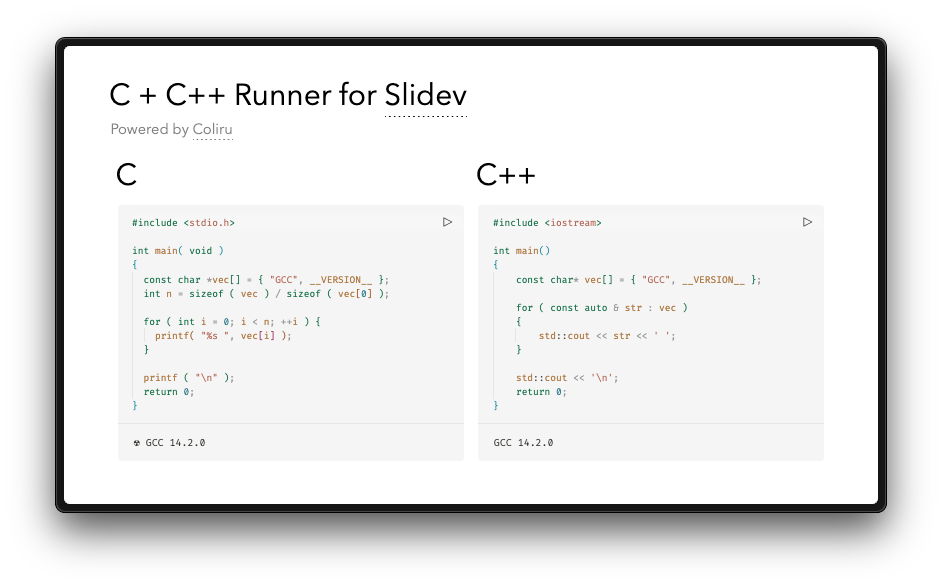

### `slidev-addon-cpp-runner`

[![NPM][npm-badge]][npm-link]
[![License][license-badge]][license-link]

A `C + C++` execution addon for [Slidev]'s Monaco Runner, powered by [Coliru]'s compilation API. Write, compile, and run `C + C++` code directly in your presentations!

<picture>
  <source media="(prefers-color-scheme: dark)" srcset="./.github/assets/screenshot-dark.png">
  
</picture>

## 🌟 Features

- 🖥️ In-slide C/C++ code execution
- ⚙️ Customizable compiler configurations
- 🔄 Real-time output display
- 📚 Support for multiple language standards
- 🎚️ Per-slide configuration overrides
- 🚦 Compiler output filtering
- 🛡️ Type-safe configuration options

## 📦 Installation

```bash
npm install slidev-addon-cpp-runner
```

Enable the addon in your [Slidev](http://sli.dev) frontmatter:

```yaml
---
addons:
- slidev-addon-cpp-runner
---
```

## 🛠️ Usage

### C Example

```yaml
# C

```c {monaco-run}
/** C2x CODE */
```

### C++ Example

```yaml
# C++

```cpp {monaco-run}
/** C++20 CODE */
```

## ⚙️ Configuration

### Global Configuration
```yaml
---
addons:
- slidev-addon-cpp-runner

# C configuration using default settings
c:
  # Compiler to use.
  compiler: 'gcc'

  # C standard.
  standard: 'c2x'

  # Optimization level.
  optimization: 'O2'

  # Compiler flags.
  flags: '-Wall -Wextra -pedantic -pthread -pedantic-errors'

  # Libraries to link.
  libraries: '-lm -latomic'

  # Additional shell commands to run after compilation.
  extraCommands: ''

  # Whether to always show the compiler output.
  alwaysShowCompilerOutput: true

# C++ configuration using default settings
cpp:
  # Compiler to use.
  compiler: 'g++'

  # C++ standard.
  standard: 'c++20'

  # Optimization level.
  optimization: 'O2'

  # Compiler flags.
  flags: '-Wall -Wextra -pedantic -pthread -pedantic-errors'

  # Libraries to link.
  libraries: '-lm -latomic'

  # Additional shell commands to run after compilation.
  extraCommands: ''

  # Whether to always show the compiler output.
  alwaysShowCompilerOutput: false

---
```

### Compiler Support

| Compiler  | Standards                      |
|-----------|--------------------------------|
| **C++**   |                                |
| g++       | 98,11,14,17,20,23             |
| clang++   | 98,11,14,17                   |
| g++-4.9   | 98,11,14                      |
| g++-5.2   | 98,11,14,1z                   |
| **C**     |                                |
| gcc       | 89,99,11,17,2x                |
| clang     | 89                            |
| g++-4.9   | 89,99,11                      |
| g++-5.2   | 89,99,11                      |
| clang++   | 99,11                         |

### Optimization Levels

| Level | Description                                  |
|-------|----------------------------------------------|
| O0    | No optimization                              |
| O1    | Basic optimization                           |
| O2    | Moderate optimization (default)              |
| O3    | Aggressive optimization                      |
| Os    | Optimize for size                            |
| Og    | Debug-friendly optimization                  |
| Ofast | Maximum performance (unsafe)                 |

## 🎚️ Per-Slide Customization
```yaml
---
cpp:
standard: 'c++17'
optimization: 'O3'
---
# Custom Compilation Settings

```cpp {monaco-run}
/** C++17 CODE */
```

## 📝 Output Formatting

- When `alwaysShowCompilerOutput` is `true`:
	- **Compiler Output**: `☘ [Compiler message]`
	- **Program Output**: `☢ [Program output]`
- When `alwaysShowCompilerOutput` is `false`:
	- Only program output is shown (unless there's a compiler error)

## 🛡️ Type Safety

The addon includes comprehensive type safety features:

- Strict validation of compiler options, standards, and optimization levels.
- Runtime validation with fallback to defaults for invalid settings.
- Console warnings for invalid configuration options.
- TypeScript interfaces for configuration validation.

## 🔧 How It Works

1. 📩 Code sent to [Coliru] API.
2. 🛠️ Compiled with specified options.
3. 🏃 Executed in secure environment.
4. 📤 Results returned to your slide.

## ⚠️ Limitations

- 🌐 Requires internet connection.
- 🛡️ Subject to [Coliru]'s services and security restrictions.

---

**Happy Coding in Your Slides!** 🎉

[//]: (Externals)

[npm-badge]: https://img.shields.io/npm/v/slidev-addon-cpp-runner
[npm-link]: https://www.npmjs.com/package/slidev-addon-cpp-runner
[license-badge]: https://img.shields.io/github/license/SOHNE/slidev-addon-cpp-runner
[license-link]: https://github.com/SOHNE/slidev-addon-cpp-runner/blob/main/LICENSE

[Slidev]: https://sli.dev
[Coliru]: https://coliru.stacked-crooked.com

[//]: (EOF)
